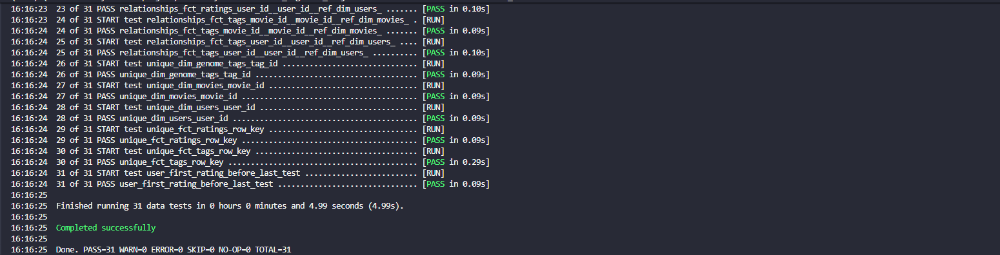
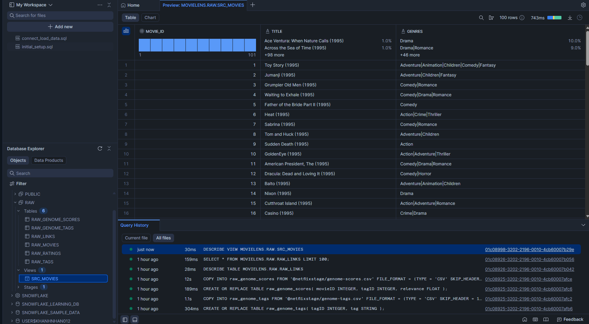
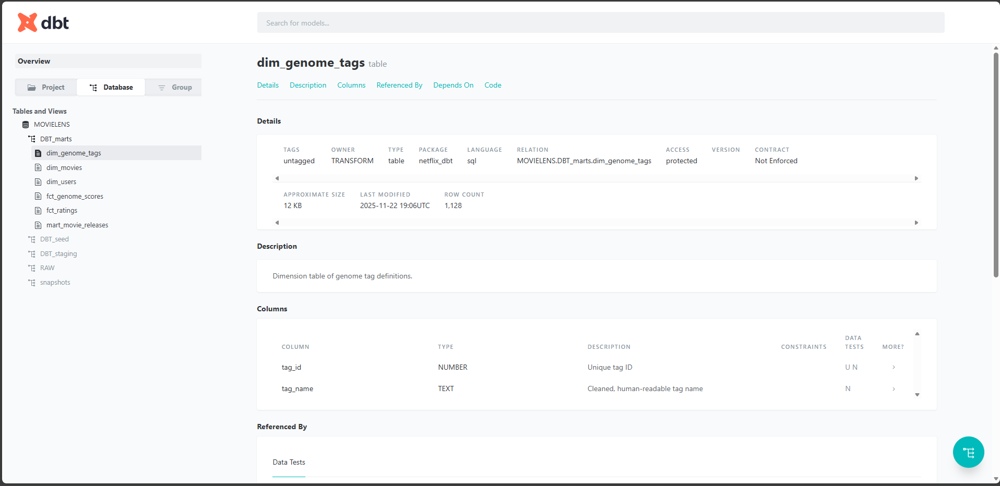
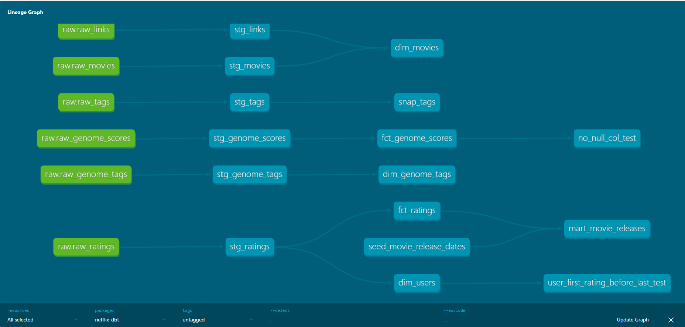

<h1 align="center">Movielens DBT Snowflake Warehouse</h1>

<p align="center">
  <a href="README.md">English</a> ·
  <a href="README.vi.md">Tiếng Việt</a>
</p>

This project implements an end-to-end data pipeline processing the [MovieLens 20M Dataset](https://grouplens.org/datasets/movielens/20m/). The goal is to transform raw movie data into a `Dimensional Data Model` following the `Kimball` methodology, specifically implementing a `Galaxy Schema (Fact Constellation)` architecture to handle multiple business processes.

The pipeline ingests raw CSVs from `AWS S3` into `Snowflake`, then utilizes `dbt (data build tool)` to orchestrate transformation, testing, and documentation.

# Architecture Overview


The pipeline follows a modern **ELT (Extract, Load, Transform)** workflow, ensuring that raw data is preserved while derived models are optimized for performance.
1. Ingestion (Extract & Load)
* **Source:** The MovieLens 20M dataset (CSVs) is uploaded to an **AWS S3** bucket, acting as the Data Lake.
* **Loading:** Snowflake interacts with S3 via an **External Stage**. Raw data is loaded directly into the `raw` schema using `COPY INTO` commands. At this stage, data is kept in its original format to ensure a reliable audit trail.
2. Staging Layer (Transformation - Part 1)
* **Orchestration:** **dbt** picks up data from the `raw` schema.
* **Cleaning & Standardization:**
    * Column names are sanitized to `snake_case`.
    * Unix timestamps are cast to Snowflake `TIMESTAMP_LTZ`.
    * **Complex Parsing:** Using Regex to extract release years from movie titles and converting pipe-separated genre strings into Snowflake `ARRAY` data types for flexible querying.
3. Marts Layer (Transformation - Part 2)
* **Modeling:** Data is reorganized into a **Star Schema** consisting of Fact and Dimension tables.
* **Optimization:**
    * **Incremental Loading:** Applied to the `fct_ratings` table (20M+ rows) to process only new or updated records, significantly reducing compute costs.
    * **Surrogate Keys:** Generated using `dbt_utils.generate_surrogate_key()` to ensure unique primary keys across the model.
* **History Tracking:** **dbt Snapshots** are used for the `tags` dataset to implement **SCD Type 2 (Slowly Changing Dimensions)**, allowing us to track how user tagging behavior changes over time.
4. Data Quality (Testing)
* Before any data is promoted to production schemas, it passes through a suite of automated tests (Uniqueness, Not Null, Referential Integrity, and Custom Logic) defined in `schema.yml` and the `tests/` directory.
# Project Structure
```
├── 📁 architecture
├── 📁 images
├── 📁 logs
├── 📁 netflix_dbt
│   ├── 📁 analyses
│   │   └── ⚙️ .gitkeep
│   ├── 📁 dbt_packages
│   ├── 📁 macros
│   │   ├── ⚙️ .gitkeep
│   │   ├── 📄 no_null_columns.sql
│   │   └── 📄 relevance_score_test.sql
│   ├── 📁 models
│   │   ├── 📁 marts
│   │   │   ├── 📁 core
│   │   │   │   ├── 📄 dim_genome_tags.sql
│   │   │   │   ├── 📄 dim_movies.sql
│   │   │   │   ├── 📄 dim_users.sql
│   │   │   │   ├── 📄 fct_genome_scores.sql
│   │   │   │   └── 📄 fct_ratings.sql
│   │   │   └── 📁 more_analysis
│   │   │       └── 📄 mart_movie_releases.sql
│   │   ├── 📁 staging
│   │   │   ├── 📄 stg_genome_scores.sql
│   │   │   ├── 📄 stg_genome_tags.sql
│   │   │   ├── 📄 stg_links.sql
│   │   │   ├── 📄 stg_movies.sql
│   │   │   ├── 📄 stg_ratings.sql
│   │   │   └── 📄 stg_tags.sql
│   │   ├── ⚙️ schema.yml
│   │   └── ⚙️ sources.yml
│   ├── 📁 seeds
│   │   ├── ⚙️ .gitkeep
│   │   └── 📄 seed_movie_release_dates.csv
│   ├── 📁 snapshots
│   │   ├── ⚙️ .gitkeep
│   │   └── 📄 snap_tags.sql
│   ├── 📁 tests
│   │   ├── ⚙️ .gitkeep
│   │   ├── 📄 no_null_col_test.sql
│   │   └── 📄 user_first_rating_before_last_test.sql
│   ├── ⚙️ .gitignore
│   ├── 📝 README.md
│   ├── ⚙️ dbt_project.yml
│   ├── ⚙️ package-lock.yml
│   └── ⚙️ packages.yml
├── 📄 LICENSE
├── 📝 README.md
├── 📝 REAME.vi.md
├── 🐍 main.py
├── ⚙️ pyproject.toml
└── 📄 uv.lock
```

# Technologies Used
| Technology       | Function                                                                                    |
|------------------|---------------------------------------------------------------------------------------------|
| Snowflake        | Data warehouse                                                                |
| dbt              | Data transformation, testing, and documentation tool                                      |
| AWS S3           | Cloud storage for raw data files                                                           |
| SQL              | Data querying and transformation language                                                  |
| Star Schema      | Data modeling technique                                          |

# Key `dbt` Features Implemented

- **Incremental Models**: Used for the massive fct_ratings table (20M+ rows) to optimize warehouse compute costs by processing only new data.

- **Snapshots (SCD Type 2)**: Implemented for tags to track changes in user-generated content over time, preserving historical accuracy.

- **Custom Macros**: Developed reusable logic (e.g., check_valid_score) to apply consistent business rules across multiple models.

- **Testing**:

  - `Generic Tests`: Uniqueness, Not Null, Accepted Values, Relationships.

  - `Singular Tests`: Custom SQL queries to validate complex logic (e.g., first_rated_at <= last_rated_at).

- **Documentation**: Fully documented lineage and column descriptions generated via dbt docs.

# Data Modeling


# Data Testing
You can use `dbt test` to run all tests defined in the project. Below is an example of a successful test run:



# Installation and Setup Guide
### Prerequisites
- Python 3.10
- Install `uv` package manager
- `dbt-snowflake` adapter 1.9.0
- Snowflake account 
- AWS S3 bucket with MovieLens dataset

### Set up in AWS S3
1. Create an S3 bucket (e.g., `movielens-dbt-bucket`).
2. Upload the MovieLens 20M dataset CSV files to the bucket.
3. Create an IAM user `snowflakeuser` with `attach policies directly` permission `AmazonS3FullAccess`.
4. Note down the `Access Key ID` and `Secret Access Key` for the IAM user.
### Set up in Snowflake
1. Create role, DW, database, schemas, `dbt` user, and grant necessary privileges.
2. Create a stage to connect Snowflake to the S3 bucket using the IAM user credentials.
3. Load raw data from S3 into the `raw` schema using `COPY INTO` commands.

### Set up dbt Project
1. Clone this repository.
2. Sync dependencies using:
   ```bash
   uv sync
   ```
3. Configure the `profiles.yml` file with your Snowflake connection details as what you set up earlier in Snowflake.
4. Run dbt commands in the following order:
   - Update packages:
     ```bash
     dbt deps
     ```
   - Upload seed data:
     ```bash
     dbt seed
     ```
   - To run all models: 
     ```bash
     dbt run
     ```
   - To run snapshots:
     ```bash
     dbt snapshot
     ```
   - To run tests:
     ```bash
     dbt test
     ```
   - To generate documentation:
     ```bash
     dbt docs generate
     dbt docs serve
     ```
5. Explore the generated documentation in your browser.


# ✉️ Contact
Feel free to connect with me on the following platforms:
- Email: khanhnhan012@gmail.com
- [](https://www.facebook.com/nguyen.khanh.nhan.905779)
- [](https://www.linkedin.com/in/nhan-nguyen-b22023260/)